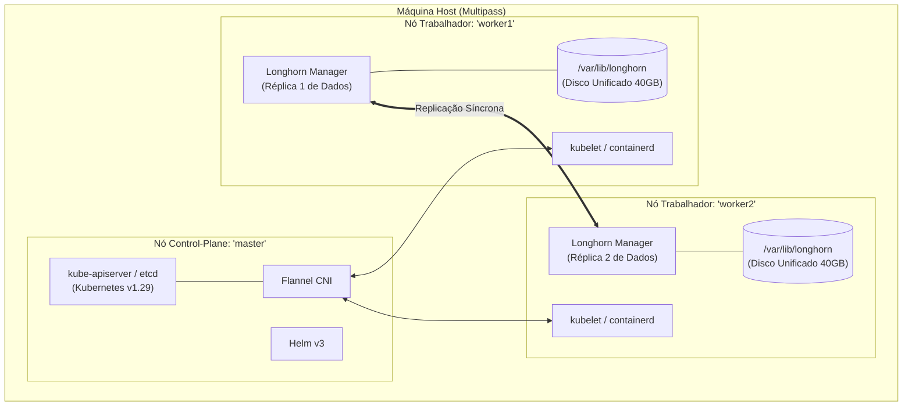

# Kubernetes-Framework: Cluster & Longhorn Distributed Storage PoC

> **Prova-de-Conceito (PoC)** de um cluster Kubernetes com armazenamento em blocos altamente distribuído e resiliente utilizando **Longhorn**, provisionado sobre nós virtuais com **Multipass**.

---

## Arquitetura do Ambiente

A topologia do laboratório consiste em 3 nós virtualizados (Ubuntu 22.04 LTS) em disco unificado de 40 GB, evitando partições complexas e utilizando o diretório padrão `/var/lib/longhorn`.



### Especificações das Máquinas Virtuais

| Nó | Papel | vCPUs | RAM | Disco | Sistema Operacional |
| :--- | :--- | :---: | :---: | :---: | :--- |
| `master` | Control-Plane | 2 | 4 GB | 40 GB | Ubuntu 22.04 LTS |
| `worker1` | Worker / Storage | 2 | 4 GB | 40 GB | Ubuntu 22.04 LTS |
| `worker2` | Worker / Storage | 2 | 4 GB | 40 GB | Ubuntu 22.04 LTS |

---

## Estrutura da Documentação

A documentação do projeto está centralizada no diretório [`docs/`](docs/):

| Documento | Descrição |
| :--- | :--- |
| [**Visão Geral e Escopo**](docs/visao-geral.md) | Fundamentação teórica, motivação acadêmica, autores e questões norteadoras da arquitetura. |
| [**Guia Completo de Implementação**](docs/guia-completo.md) | Roteiro prático passo a passo para instalação manual da infraestrutura, Kubernetes, Longhorn e teste de failover. |
| [**Relatório de Execução da PoC**](docs/relatorio-poc.md) | Evidências técnicas, status de cada tarefa (Fases 1 a 3) e validação da recuperação de desastres. |

---

## Resumo Rápido das Fases da PoC

1. **Fase 1 — Infraestrutura e Cluster**:
   - Provisionamento das VMs via Multipass.
   - Desativação de swap, parametrização do kernel (`overlay`, `br_netfilter`, `sysctl`).
   - Instalação do runtime `containerd` e ecossistema `kubeadm`/`kubelet`/`kubectl` (v1.29).
   - Inicialização do control-plane e aplicação da rede Flannel.
2. **Fase 2 — Armazenamento Distribuído (Longhorn)**:
   - Habilitação dos serviços de iSCSI (`open-iscsi`) nos nós.
   - Deploy do chart oficial do Longhorn com 2 réplicas por volume.
   - Definição da `StorageClass` padrão e emissão de PVC de teste.
3. **Fase 3 — Validação e Teste de Resiliência**:
   - Implantação de workload com montagem do volume persistente.
   - Escrita de dados de teste.
   - Simulação de falha catastrófica desligando a VM trabalhadora.
   - Migração e comprovação de integridade dos dados no nó sobrevivente.

---

## Execução Automatizada (Script Único)

Para executar todo o laboratório de ponta a ponta em qualquer máquina (com **apenas um arquivo** e sem dependências externas adicionais), utilize o script auto-contido [`deploy-completo.sh`](deploy-completo.sh):

```bash
chmod +x deploy-completo.sh
./deploy-completo.sh
```

### O que ele faz de forma 100% autônoma:
1. **Detecta e instala o Multipass** (via snap) caso ainda não esteja instalado no servidor.
2. **Provisiona as 3 VMs** no Multipass (`master`, `worker1`, `worker2`) com kernel e dependências pré-configuradas.
3. **Inicializa o Kubernetes v1.29**, configura o CNI Flannel e conecta os workers.
4. **Instala o Helm e o Longhorn** com 2 réplicas e StorageClass padrão.
5. **Executa o teste de resiliência**: cria um PVC/Pod NGINX, grava um token persistente, simula falha desligando um nó trabalhador, destrava o volume no nó sobrevivente e valida a preservação integral dos dados.

### Para destruir e limpar o ambiente:
```bash
./deploy-completo.sh --cleanup
```